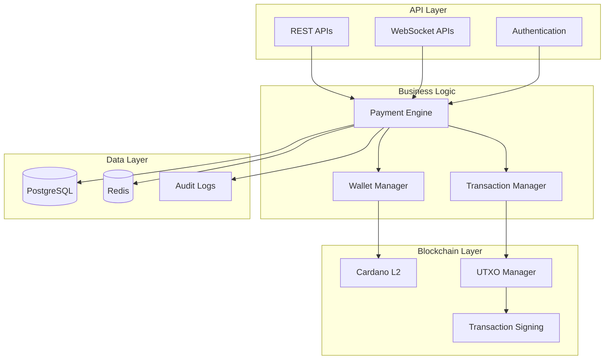

# Backend

**Core payment processing APIs and blockchain integration**

The Blazar Pay backend provides the core payment processing infrastructure, blockchain integration, and API services that power the entire ecosystem.

## Overview

The Backend system handles the core payment processing logic and provides:

- **Payment Processing**: Secure micropayment processing on Cardano L2
- **Blockchain Integration**: Direct integration with Cardano blockchain
- **API Services**: RESTful APIs for all ecosystem components
- **Transaction Management**: Complete transaction lifecycle management
- **Security & Compliance**: Enterprise-grade security and regulatory compliance

## Key Features

  

    <svg className="w-6 h-6 text-blue-600" fill="none" stroke="currentColor" viewBox="0 0 24 24">
      <path strokeLinecap="round" strokeLinejoin="round" strokeWidth={2} d="M12 8c-1.657 0-3 .895-3 2s1.343 2 3 2 3 .895 3 2-1.343 2-3 2m0-8c1.11 0 2.08.402 2.599 1M12 8V7m0 1v8m0 0v1m0-1c-1.11 0-2.08-.402-2.599-1" />
    </svg>
  

  <h3 className="text-lg font-semibold text-gray-900 dark:text-gray-100 mb-2">Payment Processing</h3>
  
High-performance micropayment processing with sub-second transaction times.

  

    <svg className="w-6 h-6 text-green-600" fill="none" stroke="currentColor" viewBox="0 0 24 24">
      <path strokeLinecap="round" strokeLinejoin="round" strokeWidth={2} d="M13 10V3L4 14h7v7l9-11h-7z" />
    </svg>
  

  <h3 className="text-lg font-semibold text-gray-900 dark:text-gray-100 mb-2">Cardano L2 Integration</h3>
  
Native integration with Cardano L2 for fast, low-cost micropayments.

  

    <svg className="w-6 h-6 text-purple-600" fill="none" stroke="currentColor" viewBox="0 0 24 24">
      <path strokeLinecap="round" strokeLinejoin="round" strokeWidth={2} d="M8 9l3 3-3 3m5 0h3M5 20h14a2 2 0 002-2V6a2 2 0 00-2-2H5a2 2 0 00-2 2v12a2 2 0 002 2z" />
    </svg>
  

  <h3 className="text-lg font-semibold text-gray-900 dark:text-gray-100 mb-2">RESTful APIs</h3>
  
Comprehensive REST API suite for all ecosystem components and integrations.

  

    <svg className="w-6 h-6 text-orange-600" fill="none" stroke="currentColor" viewBox="0 0 24 24">
      <path strokeLinecap="round" strokeLinejoin="round" strokeWidth={2} d="M9 12l2 2 4-4m5.618-4.016A11.955 11.955 0 0112 2.944a11.955 11.955 0 01-8.618 3.04A12.02 12.02 0 003 9c0 5.591 3.824 10.29 9 11.622 5.176-1.332 9-6.03 9-11.622 0-1.042-.133-2.052-.382-3.016z" />
    </svg>
  

  <h3 className="text-lg font-semibold text-gray-900 dark:text-gray-100 mb-2">Security & Compliance</h3>
  
Enterprise-grade security with regulatory compliance and audit trails.

  

    <svg className="w-6 h-6 text-red-600" fill="none" stroke="currentColor" viewBox="0 0 24 24">
      <path strokeLinecap="round" strokeLinejoin="round" strokeWidth={2} d="M4 7v10c0 2.21 3.582 4 8 4s8-1.79 8-4V7M4 7c0 2.21 3.582 4 8 4s8-1.79 8-4M4 7c0-2.21 3.582-4 8-4s8 1.79 8 4" />
    </svg>
  

  <h3 className="text-lg font-semibold text-gray-900 dark:text-gray-100 mb-2">Multi-Asset Support</h3>
  
Support for ADA and custom Cardano assets with flexible payment options.

  

    <svg className="w-6 h-6 text-indigo-600" fill="none" stroke="currentColor" viewBox="0 0 24 24">
      <path strokeLinecap="round" strokeLinejoin="round" strokeWidth={2} d="M9 19v-6a2 2 0 00-2-2H5a2 2 0 00-2 2v6a2 2 0 002 2h2a2 2 0 002-2zm0 0V9a2 2 0 012-2h2a2 2 0 012 2v10m-6 0a2 2 0 002 2h2a2 2 0 002-2m0 0V5a2 2 0 012-2h2a2 2 0 012 2v14a2 2 0 01-2 2h-2a2 2 0 01-2-2z" />
    </svg>
  

  <h3 className="text-lg font-semibold text-gray-900 dark:text-gray-100 mb-2">Analytics & Reporting</h3>
  
Comprehensive analytics and reporting for transaction monitoring and insights.

## Architecture

## Technology Stack

- **Runtime**: Node.js with TypeScript
- **Framework**: Express.js with Fastify for high-performance APIs
- **Database**: PostgreSQL with Redis caching
- **Blockchain**: Cardano L2 integration libraries
- **Authentication**: JWT with OAuth2 and API key management
- **Monitoring**: Prometheus with Grafana dashboards
- **Deployment**: Docker with Kubernetes orchestration

## API Endpoints

### Core Payment APIs

- **POST** `/payments` - Process new payments
- **GET** `/payments/{id}` - Retrieve payment details
- **GET** `/payments` - List payments with filtering
- **POST** `/payments/{id}/refund` - Process refunds

### Wallet Management APIs

- **GET** `/wallets/{address}/balance` - Get wallet balance
- **GET** `/wallets/{address}/transactions` - Get transaction history
- **POST** `/wallets/{address}/verify` - Verify wallet ownership

### Terminal Management APIs

- **GET** `/terminals` - List registered terminals
- **POST** `/terminals` - Register new terminal
- **PUT** `/terminals/{id}` - Update terminal configuration
- **DELETE** `/terminals/{id}` - Remove terminal

## Coming Soon

### 🚧 Documentation in Development

The Backend documentation is currently being developed. This section will include:

- **API Reference**: Complete REST API documentation
- **Authentication**: API key management and OAuth2 setup
- **Integration Guide**: How to integrate with backend services
- **Webhook Events**: Real-time event notifications
- **Rate Limiting**: API usage limits and best practices
- **Error Handling**: Comprehensive error codes and responses

## What's Next?

- **[Blazar Terminal](/blazar-terminal)** - Learn about the payment terminal hardware
- **[Merchant Web App](/merchant-web-app)** - Merchant dashboard and management
- **[Client Mobile App](/client-mobile-app)** - Mobile wallet integration
- **[FAQ](/faq)** - Frequently asked questions

---

> **Note**: The Backend documentation is under active development. Check back soon for comprehensive API references and integration guides.
