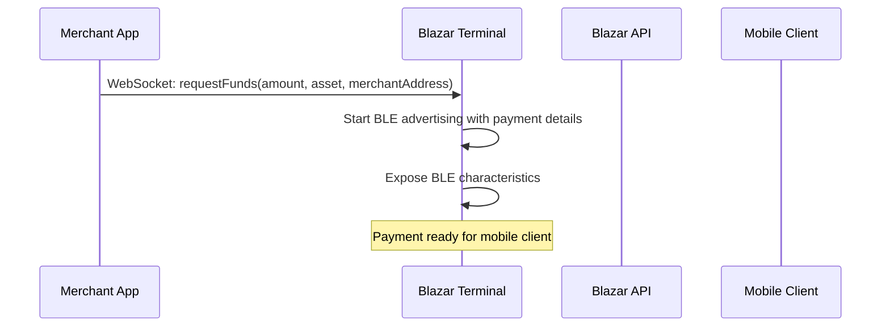
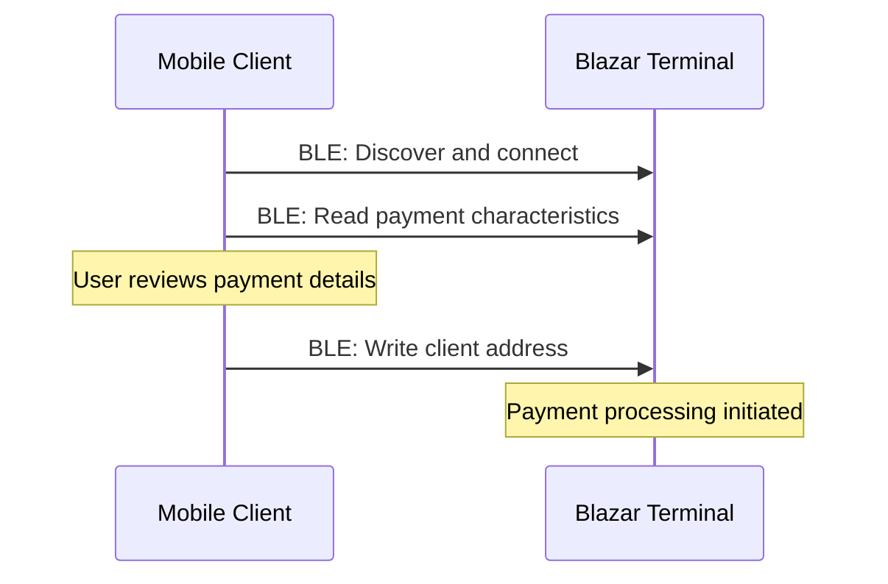
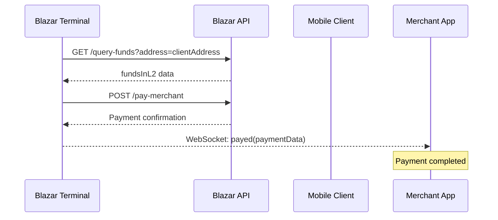
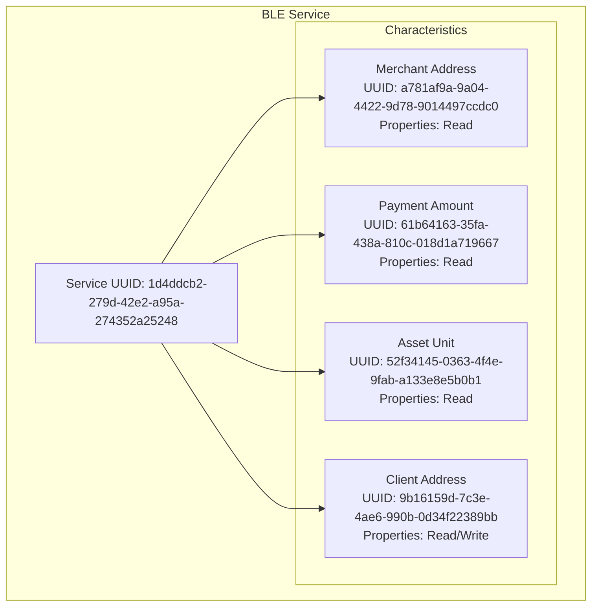
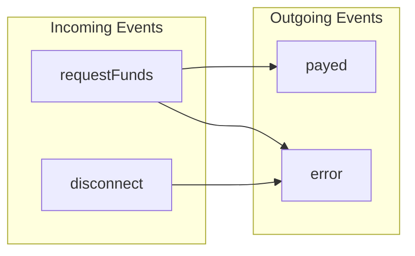

# Architecture

The Blazar Terminal architecture consists of several interconnected components that work together to enable secure, real-time micropayments on the Cardano blockchain.

## System Architecture

```text
┌─────────────────┐    ┌────────────────────┐    ┌─────────────────┐
│   Mobile App    │◄──►│  Blazar Terminal   │◄──►│   Blazar API    │
│   (BLE Client)  │    │  (BLE Peripheral)  │    │   (Backend)     │
└─────────────────┘    └────────────────────┘    └─────────────────┘
                              │
                              ▼
                       ┌─────────────────┐
                       │  Merchant App   │
                       │   (WebSocket)   │
                       └─────────────────┘
```

## Component Responsibilities

### Mobile App (BLE Client)
- **Discovery**: Scans for and discovers Blazar Terminals using BLE service UUID
- **Connection**: Establishes secure BLE connection to the terminal
- **Payment Details**: Reads merchant address, payment amount, and asset information
- **Payment Authorization**: Provides client address and authorizes payment
- **Wallet Integration**: Interfaces with Cardano mobile wallets for transaction signing

### Blazar Terminal (BLE Peripheral)
- **BLE Advertising**: Advertises payment services when a payment is requested
- **Service Exposure**: Exposes BLE characteristics for payment data exchange
- **Payment Processing**: Coordinates with Blazar API for payment verification and processing
- **WebSocket Server**: Provides real-time communication channel with merchant applications
- **Status Management**: Manages payment states and provides status updates

### Blazar API (Backend)
- **Fund Verification**: Queries client wallet balances and available UTXOs
- **Payment Processing**: Executes Cardano L2 transactions for micropayments
- **Transaction Validation**: Validates payment requests and ensures sufficient funds
- **Settlement**: Handles final settlement and transaction confirmation
- **Security**: Provides authentication and authorization for payment requests

### Merchant App (WebSocket Client)
- **Payment Initiation**: Creates and sends payment requests to the terminal
- **Real-time Updates**: Receives payment status updates via WebSocket
- **Transaction Management**: Manages payment lifecycle and completion
- **Integration**: Integrates with existing POS and e-commerce systems

## Data Flow

### 1. Payment Initiation


### 2. Mobile Client Connection


### 3. Payment Processing


## BLE Service Architecture

### Service Definition
- **Service UUID**: `1d4ddcb2-279d-42e2-a95a-274352a25248`
- **Device Name**: "Blazar TERM"
- **Advertising**: Continuous when payment is active

### Characteristic Structure


## WebSocket Architecture

### Connection Management
- **Port**: 3000
- **Protocol**: Socket.IO
- **Authentication**: Optional device key authentication
- **CORS**: Configurable origin restrictions

### Event Types


## Security Architecture

### BLE Security
- **Service Discovery**: Uses standard BLE service discovery
- **Data Transmission**: Plain text over BLE (consider additional encryption layers)
- **Access Control**: No authentication required for BLE connection

### WebSocket Security
- **Transport Security**: HTTPS/WSS recommended for production
- **Authentication**: Optional device key authentication
- **Rate Limiting**: Implement rate limiting for payment requests

### API Security
- **HTTPS**: All API communications use HTTPS
- **Authentication**: Device authentication via API keys
- **Input Validation**: Strict validation of all payment parameters
- **Audit Logging**: Comprehensive logging of all transactions

## Scalability Considerations

### Horizontal Scaling
- **Multiple Terminals**: Support for multiple terminals per merchant
- **Load Balancing**: WebSocket connections can be load balanced
- **Database Scaling**: API backend can be scaled independently

### Performance Optimization
- **BLE Connection Pooling**: Efficient management of BLE connections
- **WebSocket Connection Management**: Optimized connection handling
- **Caching**: API response caching for improved performance

## Error Handling

### BLE Error Recovery
- **Connection Drops**: Automatic reconnection attempts
- **Characteristic Access Errors**: Retry mechanisms with exponential backoff
- **Advertising Failures**: Fallback advertising strategies

### WebSocket Error Handling
- **Connection Failures**: Automatic reconnection with backoff
- **Message Failures**: Retry mechanisms for critical messages
- **Timeout Handling**: Configurable timeouts for payment requests

### API Error Handling
- **Network Failures**: Retry with exponential backoff
- **Authentication Errors**: Clear error messages and re-authentication
- **Payment Failures**: Detailed error reporting and recovery options

## Next Steps

- **[Hardware Requirements](/blazar-terminal/hardware-requirements)** - Hardware setup guide
- **[Software Dependencies](/blazar-terminal/software-dependencies)** - Required software components
- **[Installation & Setup](/blazar-terminal/installation-setup)** - Complete installation instructions
- **[BLE Protocol](/blazar-terminal/ble-protocol)** - Detailed BLE communication protocol
