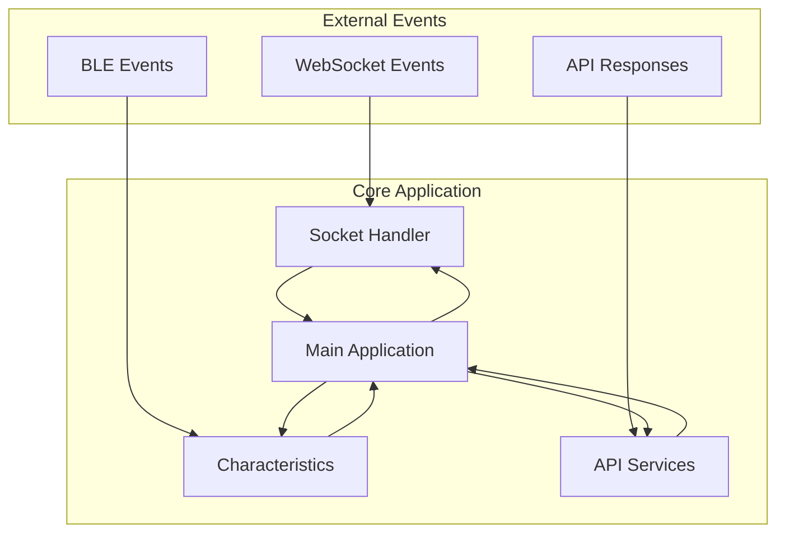

# Development

Development guidelines and best practices for the Blazar Terminal project.

## Project Structure

```
blazar-terminal/
├── src/
│   ├── index.js              # Main application entry point
│   ├── socket.js             # WebSocket server implementation
│   ├── services.js           # API service integration
│   └── characteristics.js    # BLE characteristics management
├── assets/                   # Static assets and images
├── package.json             # Node.js dependencies and scripts
├── ecosystem.config.js      # PM2 process management configuration
├── README.md                # Project documentation
└── logs/                    # Application logs
```

## Development Setup

### 1. Clone Repository

```bash
git clone <repo-url> blazar-terminal
cd blazar-terminal
```

### 2. Install Dependencies

```bash
npm install
```

### 3. Set API Endpoint

Edit `src/services.js` to set your API endpoint:

```javascript
const API_BASE_URL = 'http://your-api-server:5000';
```

### 4. Start Development Server

```bash
npm run dev
```

## Architecture

The Blazar Terminal follows a modular, event-driven architecture:

### Core Components

- **Main Application** (`index.js`): Orchestrates BLE and WebSocket services
- **BLE Service** (`characteristics.js`): Manages BLE advertising and characteristics
- **WebSocket Server** (`socket.js`): Handles merchant application communication
- **API Client** (`services.js`): Integrates with Blazar API backend

### Event Flow



## Development Guidelines

### Code Style

**JavaScript Standards**:
- Use ES6+ features
- Prefer `const` and `let` over `var`
- Use arrow functions for callbacks
- Implement proper error handling

**Naming Conventions**:
- Use camelCase for variables and functions
- Use PascalCase for classes
- Use UPPER_CASE for constants
- Use descriptive names

**Example**:
```javascript
const SERVICE_UUID = '1d4ddcb2-279d-42e2-a95a-274352a25248';

class BlazarTerminalBLE {
  constructor() {
    this.isAdvertising = false;
  }

  async startAdvertising(paymentData) {
    try {
      // Implementation
    } catch (error) {
      console.error('Advertising failed:', error);
    }
  }
}
```

### Error Handling

**Robust Error Handling**:
```javascript
async function processPayment(clientAddress, paymentData) {
  try {
    // Validate input
    if (!clientAddress || !paymentData) {
      throw new Error('Invalid payment parameters');
    }

    // Process payment
    const result = await payMerchant(clientAddress, paymentData);
    return result;
  } catch (error) {
    console.error('Payment processing failed:', error);
    
    // Log error for debugging
    logError('processPayment', error, { clientAddress, paymentData });
    
    // Re-throw for caller to handle
    throw error;
  }
}
```

### Async/Await Usage

**Preferred Pattern**:
```javascript
async function handlePaymentRequest(paymentData) {
  try {
    // Setup BLE characteristics
    const characteristics = await setupCharacteristics(paymentData);
    
    // Start advertising
    await startBLEAdvertising();
    
    // Wait for client connection
    const clientAddress = await waitForClientAddress();
    
    // Process payment
    const result = await processPayment(clientAddress, paymentData);
    
    return result;
  } catch (error) {
    console.error('Payment request failed:', error);
    throw error;
  }
}
```

## Testing

### Unit Testing

**Test Structure**:
```javascript
describe('BlazarTerminalBLE', () => {
  let terminal;

  beforeEach(() => {
    terminal = new BlazarTerminalBLE();
  });

  test('should start advertising with payment data', async () => {
    const paymentData = {
      address: 'test_address',
      amount: 10000000,
      assetUnit: 'lovelace'
    };

    await terminal.startAdvertising(paymentData);
    
    expect(terminal.isAdvertising).toBe(true);
  });

  test('should handle payment processing', async () => {
    const mockFunds = {
      fundsInL2: [{
        txHash: 'test_hash',
        outputIndex: 0
      }]
    };

    jest.mock('./services', () => ({
      queryFunds: jest.fn().mockResolvedValue(mockFunds),
      payMerchant: jest.fn().mockResolvedValue({ success: true })
    }));

    const result = await terminal.processPayment('test_address', paymentData);
    expect(result.success).toBe(true);
  });
});
```

### Integration Testing

**End-to-End Testing**:
```javascript
describe('Payment Flow Integration', () => {
  test('should complete payment flow', async () => {
    // Setup test environment
    const terminal = new BlazarTerminal();
    const merchant = new MerchantClient();
    const mobile = new MobileClient();

    // Initiate payment
    await merchant.initiatePayment('merchant_address', 10000000);

    // Mobile client connects and pays
    await mobile.connectToTerminal();
    await mobile.processPayment('client_address');

    // Verify payment completion
    const payment = await merchant.getLastPayment();
    expect(payment.status).toBe('completed');
  });
});
```

### BLE Testing

**BLE Functionality Testing**:
```javascript
describe('BLE Functionality', () => {
  test('should advertise with correct service UUID', async () => {
    const terminal = new BlazarTerminalBLE();
    
    await terminal.startAdvertising({
      address: 'test_address',
      amount: 10000000,
      assetUnit: 'lovelace'
    });

    // Verify advertising parameters
    expect(terminal.service.uuid).toBe('1d4ddcb2-279d-42e2-a95a-274352a25248');
    expect(terminal.isAdvertising).toBe(true);
  });
});
```

## Debugging

### Debug Logging

**Structured Logging**:
```javascript
const debug = require('debug')('blazar-terminal');

function logPaymentEvent(event, data) {
  debug(`Payment Event: ${event}`, {
    timestamp: new Date().toISOString(),
    data: data
  });
}

// Usage
logPaymentEvent('payment_initiated', {
  merchantAddress: 'addr1...',
  amount: 10000000
});
```

### Debug Mode

**Enable Debug Mode**:
```bash
# Set debug environment variable
export DEBUG=blazar-terminal:*

# Start with debug logging
npm run dev
```

### BLE Debugging

**BLE Debug Tools**:
```bash
# Monitor BLE activity
sudo hcitool lescan

# Check BLE characteristics
sudo gatttool -b <device_address> --characteristics

# Monitor Bluetooth logs
sudo journalctl -u bluetooth -f
```

## Performance Optimization

### Memory Management

**Efficient Memory Usage**:
```javascript
class ConnectionManager {
  constructor() {
    this.connections = new Map();
    this.maxConnections = 10;
  }

  addConnection(id, connection) {
    if (this.connections.size >= this.maxConnections) {
      this.removeOldestConnection();
    }
    this.connections.set(id, connection);
  }

  removeConnection(id) {
    const connection = this.connections.get(id);
    if (connection) {
      connection.disconnect();
      this.connections.delete(id);
    }
  }

  removeOldestConnection() {
    const oldestId = this.connections.keys().next().value;
    this.removeConnection(oldestId);
  }
}
```

### Caching

**API Response Caching**:
```javascript
class ApiCache {
  constructor(ttl = 300000) { // 5 minutes
    this.cache = new Map();
    this.ttl = ttl;
  }

  get(key) {
    const item = this.cache.get(key);
    if (!item) return null;
    
    if (Date.now() - item.timestamp > this.ttl) {
      this.cache.delete(key);
      return null;
    }
    
    return item.value;
  }

  set(key, value) {
    this.cache.set(key, {
      value,
      timestamp: Date.now()
    });
  }
}
```

### Connection Pooling

**Efficient Connection Management**:
```javascript
class ConnectionPool {
  constructor(maxConnections = 5) {
    this.maxConnections = maxConnections;
    this.activeConnections = 0;
    this.queue = [];
  }

  async executeRequest(requestFn) {
    if (this.activeConnections >= this.maxConnections) {
      return new Promise((resolve, reject) => {
        this.queue.push({ requestFn, resolve, reject });
      });
    }

    this.activeConnections++;
    try {
      const result = await requestFn();
      this.activeConnections--;
      this.processQueue();
      return result;
    } catch (error) {
      this.activeConnections--;
      this.processQueue();
      throw error;
    }
  }
}
```

## Security

### Input Validation

**Secure Input Handling**:
```javascript
function validatePaymentRequest(data) {
  const errors = [];

  if (!data.address || typeof data.address !== 'string') {
    errors.push('Invalid merchant address');
  }

  if (!data.amount || typeof data.amount !== 'number' || data.amount <= 0) {
    errors.push('Invalid payment amount');
  }

  if (!data.assetUnit || typeof data.assetUnit !== 'string') {
    errors.push('Invalid asset unit');
  }

  if (errors.length > 0) {
    throw new Error(`Validation failed: ${errors.join(', ')}`);
  }

  return true;
}
```

### Secure Communication

**HTTPS Implementation**:
```javascript
const https = require('https');
const fs = require('fs');

// Load SSL certificates
const options = {
  key: fs.readFileSync('path/to/private-key.pem'),
  cert: fs.readFileSync('path/to/certificate.pem')
};

// Create HTTPS server
const server = https.createServer(options, app);
```

### Rate Limiting

**API Rate Limiting**:
```javascript
class RateLimiter {
  constructor(requestsPerMinute = 60) {
    this.requestsPerMinute = requestsPerMinute;
    this.requests = new Map();
  }

  isAllowed(clientId) {
    const now = Date.now();
    const clientRequests = this.requests.get(clientId) || [];
    
    // Remove old requests
    const recentRequests = clientRequests.filter(
      time => now - time < 60000
    );
    
    if (recentRequests.length >= this.requestsPerMinute) {
      return false;
    }
    
    recentRequests.push(now);
    this.requests.set(clientId, recentRequests);
    return true;
  }
}
```

## Deployment

### Production Build

**Build for Production**:
```bash
# Install production dependencies only
npm install --production

# Start with PM2
pm2 start ecosystem.config.js

# Save PM2 configuration
pm2 save

# Setup PM2 startup
pm2 startup
```

### Environment Configuration

**Environment Variables**:
```bash
# Production environment
export NODE_ENV=production
export API_BASE_URL=https://api.blazarpay.com
export LOG_LEVEL=info

# Development environment
export NODE_ENV=development
export API_BASE_URL=http://localhost:5000
export LOG_LEVEL=debug
```

### Monitoring

**Health Checks**:
```javascript
app.get('/health', (req, res) => {
  res.json({
    status: 'healthy',
    timestamp: new Date().toISOString(),
    uptime: process.uptime(),
    memory: process.memoryUsage()
  });
});
```

## Contributing

### Code Review Process

1. **Create Feature Branch**: `git checkout -b feature/new-feature`
2. **Write Tests**: Ensure all new code has tests
3. **Run Tests**: `npm test`
4. **Code Review**: Submit pull request for review
5. **Merge**: After approval, merge to main branch

### Commit Messages

**Conventional Commits**:
```
feat: add BLE characteristic validation
fix: resolve WebSocket connection timeout
docs: update API documentation
test: add unit tests for payment processing
```

### Pull Request Template

```markdown
## Description
Brief description of changes

## Type of Change
- [ ] Bug fix
- [ ] New feature
- [ ] Breaking change
- [ ] Documentation update

## Testing
- [ ] Unit tests pass
- [ ] Integration tests pass
- [ ] Manual testing completed

## Checklist
- [ ] Code follows style guidelines
- [ ] Self-review completed
- [ ] Documentation updated
- [ ] Tests added/updated
```

## Next Steps

- **[Troubleshooting](/blazar-terminal/troubleshooting)** - Common issues and solutions
- **[Usage Guide](/blazar-terminal/usage-guide)** - Usage instructions
- **[API Integration](/blazar-terminal/api-integration)** - Backend API integration
- **[Payment Flow](/blazar-terminal/payment-flow)** - Payment processing flow
