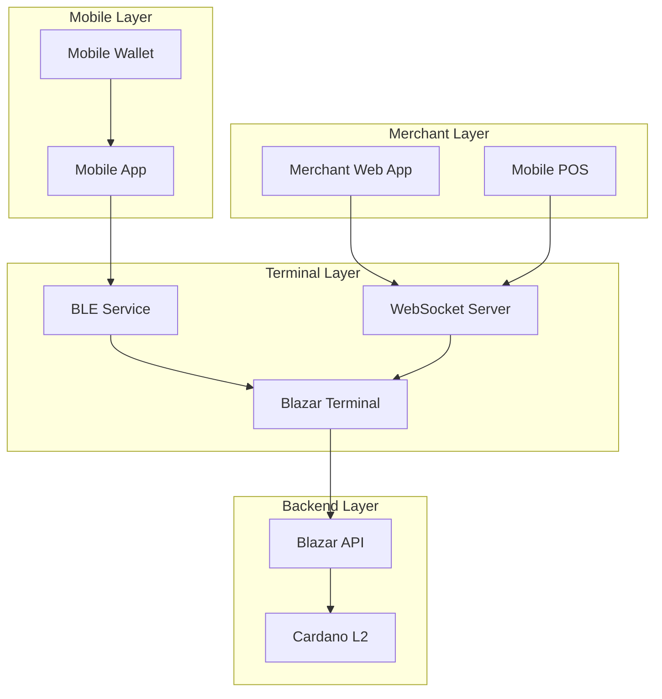

# Overview

The Blazar Terminal is a Bluetooth Low Energy (BLE) contactless payment terminal designed for the Blazar Pay micropayments system on Cardano. It serves as the bridge between mobile wallets and merchant applications, enabling secure, low-latency micropayments for both ADA and custom assets.

## Core Functionality

The Blazar Terminal operates as a BLE peripheral device that:

- **Advertises payment requests** to nearby mobile devices
- **Exposes payment details** through BLE characteristics
- **Processes payments** via integration with the Blazar API
- **Notifies merchant applications** of payment completion via WebSocket

## System Components

## Key Capabilities

### BLE Communication
- **Service Discovery**: Mobile apps can discover the terminal using the service UUID
- **Payment Data Exchange**: Secure transmission of payment details via BLE characteristics
- **Real-time Updates**: Instant notification of payment status changes

### WebSocket Integration
- **Merchant Communication**: Real-time bidirectional communication with merchant applications
- **Payment Requests**: Receive payment initiation requests from merchant apps
- **Status Updates**: Send payment completion notifications

### Cardano Integration
- **Multi-Asset Support**: Handle ADA and custom Cardano assets
- **L2 Processing**: Leverage Cardano L2 for fast, low-cost micropayments
- **Secure Transactions**: Built-in verification and authorization

## Use Cases

### Retail Payments
- **Point of Sale**: Traditional retail environments with contactless payments
- **Mobile Vendors**: Food trucks, markets, and pop-up shops
- **Service Providers**: Hair salons, repair shops, and other service businesses

### Event Payments
- **Conferences**: Registration fees, merchandise, and food purchases
- **Festivals**: Food vendors, merchandise, and ticket upgrades
- **Sports Events**: Concessions, merchandise, and premium services

### Microtransactions
- **Content Access**: Pay-per-view, premium content, and subscriptions
- **Gaming**: In-game purchases, upgrades, and virtual items
- **IoT Payments**: Machine-to-machine payments for services

## Benefits

### For Merchants
- **Low Transaction Fees**: Reduced costs compared to traditional payment processors
- **Fast Settlement**: Near-instant payment confirmation
- **Easy Integration**: Simple WebSocket-based integration
- **Portable Solution**: Compact hardware suitable for mobile operations

### For Customers
- **Contactless Payments**: Quick and hygienic payment experience
- **Mobile Wallet Support**: Works with existing Cardano mobile wallets
- **Low Fees**: Minimal transaction costs passed to customers
- **Secure Transactions**: Blockchain-based security and transparency

### For Developers
- **Open Standards**: BLE and WebSocket protocols for easy integration
- **Comprehensive APIs**: Well-documented REST and WebSocket APIs
- **SDK Support**: Multiple programming languages and frameworks
- **Flexible Architecture**: Modular design for customization

## Technical Specifications

| Specification | Value |
|---------------|-------|
| **Hardware Platform** | Raspberry Pi Zero 2W |
| **Communication** | Bluetooth Low Energy 4.2+ |
| **Network Protocol** | WebSocket (Socket.IO) |
| **Operating System** | Raspberry Pi OS Lite |
| **Runtime** | Node.js 16+ |
| **Power Consumption** | ~2.5W active, ~1.5W idle |
| **Operating Range** | 0°C to +70°C |

## Next Steps

- **[Architecture](/blazar-terminal/architecture)** - Detailed system architecture
- **[Hardware Requirements](/blazar-terminal/hardware-requirements)** - Hardware setup guide
- **[Installation & Setup](/blazar-terminal/installation-setup)** - Software installation
- **[BLE Protocol](/blazar-terminal/ble-protocol)** - BLE communication details
