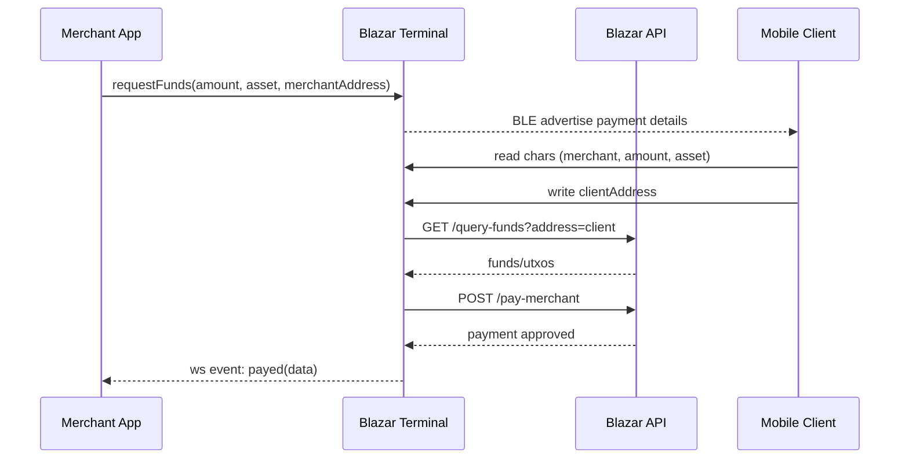

# Payment Flow

The Blazar Terminal payment flow involves multiple components working together to process secure micropayments on Cardano L2.

## Payment Flow Overview



## Detailed Payment Steps

### 1. Payment Initiation

The merchant application initiates a payment by sending a `requestFunds` event to the Blazar Terminal via WebSocket.

**Merchant App Code**:
```javascript
const io = require('socket.io-client');

class BlazarPaymentClient {
  constructor(terminalUrl) {
    this.socket = io(terminalUrl);
    this.setupEventHandlers();
  }

  setupEventHandlers() {
    this.socket.on('connect', () => {
      console.log('Connected to Blazar Terminal');
    });

    this.socket.on('payed', (paymentData) => {
      this.handlePaymentSuccess(paymentData);
    });
  }

  initiatePayment(merchantAddress, amount, assetUnit = 'lovelace') {
    this.socket.emit('requestFunds', {
      address: merchantAddress,
      amount: amount,
      decimals: 6, // ADA decimals
      assetUnit: assetUnit
    });
  }

  handlePaymentSuccess(paymentData) {
    console.log('Payment successful:', {
      client: paymentData.clientAddress,
      amount: paymentData.amount,
      merchant: paymentData.merchantAddress
    });
  }
}
```

### 2. Terminal BLE Advertising

The Blazar Terminal receives the payment request and starts BLE advertising with payment details.

**Terminal Implementation**:
```javascript
// Terminal starts BLE advertising
bleno.startAdvertising('Blazar TERM', [SERVICE_UUID]);

// Sets up BLE characteristics with payment data
const { Char1, Char2, Char3, Char4 } = setupCharacteristics({
  address: 'merchant_cardano_address',
  amount: 25.0,
  decimals: 6,
  assetUnit: 'lovelace'
});
```

### 3. Mobile Client Discovery

The mobile wallet discovers the Blazar Terminal and connects to read payment details.

**Mobile Client Code**:
```javascript
// Mobile wallet scans for terminal
const terminal = await scanForTerminal('Blazar TERM');

// Connects to BLE service
await terminal.connect();

// Reads payment details
const paymentDetails = await getPaymentDetails(terminal);
```

### 4. Payment Authorization

The mobile client writes the client address to authorize the payment, triggering the processing flow.

**Payment Authorization**:
```javascript
// Mobile wallet initiates payment
await initiatePayment(clientAddress);

// Terminal processes payment via API
const funds = await queryFunds(clientAddress);
const payment = await payMerchant(paymentData);
```

### 5. Payment Processing

The terminal queries the Blazar API for funds and processes the payment.

**API Integration**:
```javascript
// Query client funds
const funds = await queryFunds(clientAddress);

// Process payment
const payment = await payMerchant({
  clientAddress,
  merchantAddress: paymentData.address,
  amount: paymentData.amount,
  txHash: funds.fundsInL2[0].txHash,
  outputIndex: funds.fundsInL2[0].outputIndex,
  assetUnit: paymentData.assetUnit
});
```

### 6. Payment Completion

The terminal notifies the merchant application of successful payment completion.

**Completion Notification**:
```javascript
// Terminal notifies merchant
socket.emit('payed', {
  clientAddress: clientAddress,
  merchantAddress: merchantAddress,
  amount: paymentData.amount,
  transactionId: payment.transactionId
});
```

## Complete Implementation Example

### Merchant Application

```javascript
const io = require('socket.io-client');

class BlazarPaymentClient {
  constructor(terminalUrl) {
    this.socket = io(terminalUrl);
    this.setupEventHandlers();
  }

  setupEventHandlers() {
    this.socket.on('connect', () => {
      console.log('Connected to Blazar Terminal');
    });

    this.socket.on('payed', (paymentData) => {
      this.handlePaymentSuccess(paymentData);
    });
  }

  initiatePayment(merchantAddress, amount, assetUnit = 'lovelace') {
    this.socket.emit('requestFunds', {
      address: merchantAddress,
      amount: amount,
      decimals: 6, // ADA decimals
      assetUnit: assetUnit
    });
  }

  handlePaymentSuccess(paymentData) {
    console.log('Payment successful:', {
      client: paymentData.clientAddress,
      amount: paymentData.amount,
      merchant: paymentData.merchantAddress
    });
  }
}

// Usage
const terminal = new BlazarPaymentClient('http://192.168.1.100:3000');
terminal.initiatePayment('addr1q9x...', 15.5);
```

### Terminal Implementation

```javascript
// Terminal starts BLE advertising
bleno.startAdvertising('Blazar TERM', [SERVICE_UUID]);

// Sets up BLE characteristics with payment data
const { Char1, Char2, Char3, Char4 } = setupCharacteristics({
  address: 'merchant_cardano_address',
  amount: 25.0,
  decimals: 6,
  assetUnit: 'lovelace'
});
```

### Mobile Client Implementation

```javascript
// Mobile wallet scans for terminal
const terminal = await scanForTerminal('Blazar TERM');

// Connects to BLE service
await terminal.connect();

// Reads payment details
const paymentDetails = await getPaymentDetails(terminal);
```

### Payment Processing

```javascript
// Mobile wallet initiates payment
await initiatePayment(clientAddress);

// Terminal processes payment via API
const funds = await queryFunds(clientAddress);
const payment = await payMerchant(paymentData);
```

## Error Handling

### Payment Failures

**Common Failure Scenarios**:
- Insufficient funds
- Network connectivity issues
- BLE connection problems
- API server errors

**Error Handling Implementation**:
```javascript
async function processPayment(clientAddress, paymentData) {
  try {
    // Query funds
    const funds = await queryFunds(clientAddress);
    
    if (!funds.fundsInL2 || funds.fundsInL2.length === 0) {
      throw new Error('Insufficient funds');
    }

    // Process payment
    const payment = await payMerchant({
      clientAddress,
      merchantAddress: paymentData.address,
      amount: paymentData.amount,
      txHash: funds.fundsInL2[0].txHash,
      outputIndex: funds.fundsInL2[0].outputIndex,
      assetUnit: paymentData.assetUnit
    });

    return payment;
  } catch (error) {
    console.error('Payment processing failed:', error);
    throw error;
  }
}
```

### Timeout Handling

**Payment Timeout Configuration**:
```javascript
const PAYMENT_TIMEOUT = 30000; // 30 seconds

async function processPaymentWithTimeout(clientAddress, paymentData) {
  return Promise.race([
    processPayment(clientAddress, paymentData),
    new Promise((_, reject) => 
      setTimeout(() => reject(new Error('Payment timeout')), PAYMENT_TIMEOUT)
    )
  ]);
}
```

## Security Considerations

### Payment Validation

**Input Validation**:
```javascript
function validatePaymentRequest(paymentData) {
  if (!paymentData.address || !paymentData.amount) {
    throw new Error('Invalid payment request');
  }

  if (paymentData.amount <= 0) {
    throw new Error('Invalid payment amount');
  }

  if (!isValidCardanoAddress(paymentData.address)) {
    throw new Error('Invalid Cardano address');
  }

  return true;
}
```

### Transaction Security

**Secure Payment Processing**:
- Validate all payment parameters
- Verify fund availability before processing
- Implement proper error handling
- Log all payment attempts
- Use secure communication channels

## Performance Optimization

### Connection Management

**Efficient BLE Management**:
```javascript
class BLEConnectionManager {
  constructor() {
    this.connections = new Map();
    this.maxConnections = 5;
  }

  async establishConnection(deviceId) {
    if (this.connections.size >= this.maxConnections) {
      await this.closeOldestConnection();
    }

    const connection = await this.createConnection(deviceId);
    this.connections.set(deviceId, connection);
    return connection;
  }

  async closeConnection(deviceId) {
    const connection = this.connections.get(deviceId);
    if (connection) {
      await connection.disconnect();
      this.connections.delete(deviceId);
    }
  }
}
```

### Caching

**API Response Caching**:
```javascript
class PaymentCache {
  constructor() {
    this.cache = new Map();
    this.ttl = 60000; // 1 minute
  }

  get(key) {
    const item = this.cache.get(key);
    if (!item) return null;

    if (Date.now() - item.timestamp > this.ttl) {
      this.cache.delete(key);
      return null;
    }

    return item.value;
  }

  set(key, value) {
    this.cache.set(key, {
      value,
      timestamp: Date.now()
    });
  }
}
```

## Testing

### Unit Tests

**Payment Flow Testing**:
```javascript
describe('Payment Flow', () => {
  test('should process payment successfully', async () => {
    const mockFunds = {
      fundsInL2: [{
        txHash: 'test_hash',
        outputIndex: 0
      }]
    };

    const mockPayment = {
      transactionId: 'test_tx_id',
      status: 'confirmed'
    };

    // Mock API calls
    jest.mock('./api', () => ({
      queryFunds: jest.fn().mockResolvedValue(mockFunds),
      payMerchant: jest.fn().mockResolvedValue(mockPayment)
    }));

    const result = await processPayment('test_address', {
      address: 'merchant_address',
      amount: 10000000,
      assetUnit: 'lovelace'
    });

    expect(result).toEqual(mockPayment);
  });
});
```

### Integration Tests

**End-to-End Testing**:
```javascript
describe('End-to-End Payment Flow', () => {
  test('should complete payment flow', async () => {
    // Setup test environment
    const terminal = new BlazarTerminal();
    const merchant = new MerchantClient();
    const mobile = new MobileClient();

    // Initiate payment
    await merchant.initiatePayment('merchant_address', 10000000);

    // Mobile client connects and pays
    await mobile.connectToTerminal();
    await mobile.processPayment('client_address');

    // Verify payment completion
    const payment = await merchant.getLastPayment();
    expect(payment.status).toBe('completed');
  });
});
```

## Next Steps

- **[Usage Guide](/blazar-terminal/usage-guide)** - Usage instructions
- **[Troubleshooting](/blazar-terminal/troubleshooting)** - Common issues and solutions
- **[Development](/blazar-terminal/development)** - Development guidelines
- **[API Integration](/blazar-terminal/api-integration)** - Backend API integration
